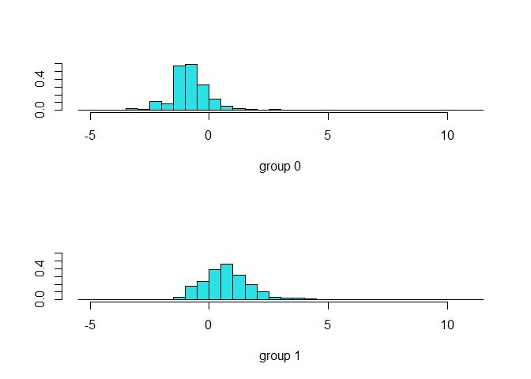
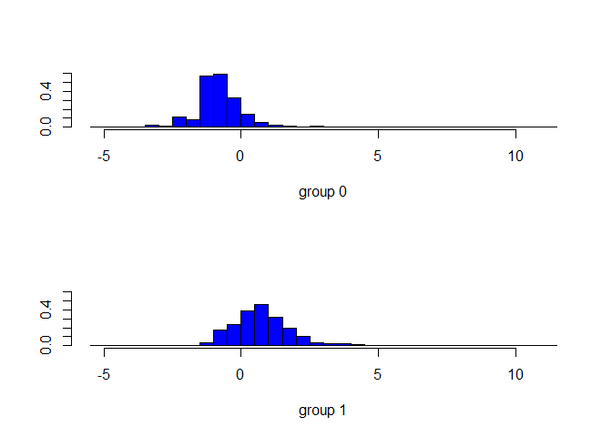
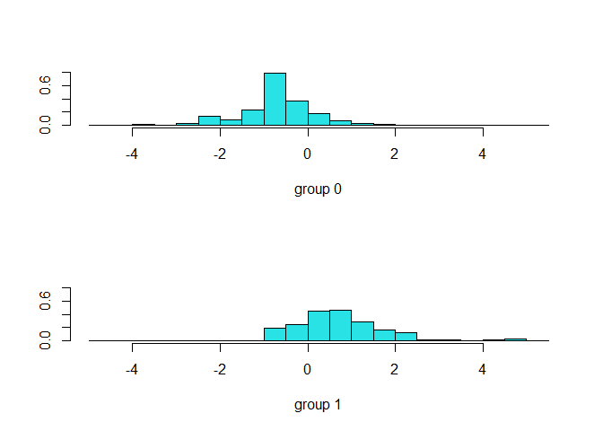

### Email Spam Classifier using R

R Markdown
----------

This is an R Markdown document. Markdown is a simple formatting syntax
for authoring HTML, PDF, and MS Word documents. For more details on
using R Markdown see
<a href="http://rmarkdown.rstudio.com" class="uri">http://rmarkdown.rstudio.com</a>.

When you click the **Knit** button a document will be generated that
includes both content as well as the output of any embedded R code
chunks within the document. You can embed an R code chunk like this:

\#Load Packages

``` r
if(!require("pacman")) install.packages("pacman")
```

    ## Loading required package: pacman

``` r
pacman::p_load(tidyverse, reshape, gplots, ggmap, MASS, 
               mlbench, data.table,leaps, pivottabler, forecast, dplyr,caret)
```

\#Read Data

``` r
Spam_Data <- fread ("spambase.data")
Spam_DF <- setDF (Spam_Data)
str(Spam_DF)
```

    ## 'data.frame':    4601 obs. of  58 variables:
    ##  $ V1 : num  0 0.21 0.06 0 0 0 0 0 0.15 0.06 ...
    ##  $ V2 : num  0.64 0.28 0 0 0 0 0 0 0 0.12 ...
    ##  $ V3 : num  0.64 0.5 0.71 0 0 0 0 0 0.46 0.77 ...
    ##  $ V4 : num  0 0 0 0 0 0 0 0 0 0 ...
    ##  $ V5 : num  0.32 0.14 1.23 0.63 0.63 1.85 1.92 1.88 0.61 0.19 ...
    ##  $ V6 : num  0 0.28 0.19 0 0 0 0 0 0 0.32 ...
    ##  $ V7 : num  0 0.21 0.19 0.31 0.31 0 0 0 0.3 0.38 ...
    ##  $ V8 : num  0 0.07 0.12 0.63 0.63 1.85 0 1.88 0 0 ...
    ##  $ V9 : num  0 0 0.64 0.31 0.31 0 0 0 0.92 0.06 ...
    ##  $ V10: num  0 0.94 0.25 0.63 0.63 0 0.64 0 0.76 0 ...
    ##  $ V11: num  0 0.21 0.38 0.31 0.31 0 0.96 0 0.76 0 ...
    ##  $ V12: num  0.64 0.79 0.45 0.31 0.31 0 1.28 0 0.92 0.64 ...
    ##  $ V13: num  0 0.65 0.12 0.31 0.31 0 0 0 0 0.25 ...
    ##  $ V14: num  0 0.21 0 0 0 0 0 0 0 0 ...
    ##  $ V15: num  0 0.14 1.75 0 0 0 0 0 0 0.12 ...
    ##  $ V16: num  0.32 0.14 0.06 0.31 0.31 0 0.96 0 0 0 ...
    ##  $ V17: num  0 0.07 0.06 0 0 0 0 0 0 0 ...
    ##  $ V18: num  1.29 0.28 1.03 0 0 0 0.32 0 0.15 0.12 ...
    ##  $ V19: num  1.93 3.47 1.36 3.18 3.18 0 3.85 0 1.23 1.67 ...
    ##  $ V20: num  0 0 0.32 0 0 0 0 0 3.53 0.06 ...
    ##  $ V21: num  0.96 1.59 0.51 0.31 0.31 0 0.64 0 2 0.71 ...
    ##  $ V22: num  0 0 0 0 0 0 0 0 0 0 ...
    ##  $ V23: num  0 0.43 1.16 0 0 0 0 0 0 0.19 ...
    ##  $ V24: num  0 0.43 0.06 0 0 0 0 0 0.15 0 ...
    ##  $ V25: num  0 0 0 0 0 0 0 0 0 0 ...
    ##  $ V26: num  0 0 0 0 0 0 0 0 0 0 ...
    ##  $ V27: num  0 0 0 0 0 0 0 0 0 0 ...
    ##  $ V28: num  0 0 0 0 0 0 0 0 0 0 ...
    ##  $ V29: num  0 0 0 0 0 0 0 0 0 0 ...
    ##  $ V30: num  0 0 0 0 0 0 0 0 0 0 ...
    ##  $ V31: num  0 0 0 0 0 0 0 0 0 0 ...
    ##  $ V32: num  0 0 0 0 0 0 0 0 0 0 ...
    ##  $ V33: num  0 0 0 0 0 0 0 0 0.15 0 ...
    ##  $ V34: num  0 0 0 0 0 0 0 0 0 0 ...
    ##  $ V35: num  0 0 0 0 0 0 0 0 0 0 ...
    ##  $ V36: num  0 0 0 0 0 0 0 0 0 0 ...
    ##  $ V37: num  0 0.07 0 0 0 0 0 0 0 0 ...
    ##  $ V38: num  0 0 0 0 0 0 0 0 0 0 ...
    ##  $ V39: num  0 0 0 0 0 0 0 0 0 0 ...
    ##  $ V40: num  0 0 0.06 0 0 0 0 0 0 0 ...
    ##  $ V41: num  0 0 0 0 0 0 0 0 0 0 ...
    ##  $ V42: num  0 0 0 0 0 0 0 0 0 0 ...
    ##  $ V43: num  0 0 0.12 0 0 0 0 0 0.3 0 ...
    ##  $ V44: num  0 0 0 0 0 0 0 0 0 0.06 ...
    ##  $ V45: num  0 0 0.06 0 0 0 0 0 0 0 ...
    ##  $ V46: num  0 0 0.06 0 0 0 0 0 0 0 ...
    ##  $ V47: num  0 0 0 0 0 0 0 0 0 0 ...
    ##  $ V48: num  0 0 0 0 0 0 0 0 0 0 ...
    ##  $ V49: num  0 0 0.01 0 0 0 0 0 0 0.04 ...
    ##  $ V50: num  0 0.132 0.143 0.137 0.135 0.223 0.054 0.206 0.271 0.03 ...
    ##  $ V51: num  0 0 0 0 0 0 0 0 0 0 ...
    ##  $ V52: num  0.778 0.372 0.276 0.137 0.135 0 0.164 0 0.181 0.244 ...
    ##  $ V53: num  0 0.18 0.184 0 0 0 0.054 0 0.203 0.081 ...
    ##  $ V54: num  0 0.048 0.01 0 0 0 0 0 0.022 0 ...
    ##  $ V55: num  3.76 5.11 9.82 3.54 3.54 ...
    ##  $ V56: int  61 101 485 40 40 15 4 11 445 43 ...
    ##  $ V57: int  278 1028 2259 191 191 54 112 49 1257 749 ...
    ##  $ V58: int  1 1 1 1 1 1 1 1 1 1 ...

``` r
class(Spam_DF)
```

    ## [1] "data.frame"

\#Examine how each predictor is different between spam & non-sapm email
by comparing class averages.

``` r
library(dplyr)
Pivot <- Spam_DF %>%
  group_by (V58)%>%
  summarise_all(funs(mean))
```

    ## Warning: `funs()` is deprecated as of dplyr 0.8.0.
    ## Please use a list of either functions or lambdas: 
    ## 
    ##   # Simple named list: 
    ##   list(mean = mean, median = median)
    ## 
    ##   # Auto named with `tibble::lst()`: 
    ##   tibble::lst(mean, median)
    ## 
    ##   # Using lambdas
    ##   list(~ mean(., trim = .2), ~ median(., na.rm = TRUE))
    ## This warning is displayed once every 8 hours.
    ## Call `lifecycle::last_warnings()` to see where this warning was generated.

``` r
head(Pivot)
```

    ## # A tibble: 2 x 58
    ##     V58     V1    V2    V3      V4    V5     V6      V7     V8     V9   V10
    ##   <int>  <dbl> <dbl> <dbl>   <dbl> <dbl>  <dbl>   <dbl>  <dbl>  <dbl> <dbl>
    ## 1     0 0.0735 0.244 0.201 8.86e-4 0.181 0.0445 0.00938 0.0384 0.0380 0.167
    ## 2     1 0.152  0.165 0.404 1.65e-1 0.514 0.175  0.275   0.208  0.170  0.351
    ## # ... with 47 more variables: V11 <dbl>, V12 <dbl>, V13 <dbl>, V14 <dbl>,
    ## #   V15 <dbl>, V16 <dbl>, V17 <dbl>, V18 <dbl>, V19 <dbl>, V20 <dbl>,
    ## #   V21 <dbl>, V22 <dbl>, V23 <dbl>, V24 <dbl>, V25 <dbl>, V26 <dbl>,
    ## #   V27 <dbl>, V28 <dbl>, V29 <dbl>, V30 <dbl>, V31 <dbl>, V32 <dbl>,
    ## #   V33 <dbl>, V34 <dbl>, V35 <dbl>, V36 <dbl>, V37 <dbl>, V38 <dbl>,
    ## #   V39 <dbl>, V40 <dbl>, V41 <dbl>, V42 <dbl>, V43 <dbl>, V44 <dbl>,
    ## #   V45 <dbl>, V46 <dbl>, V47 <dbl>, V48 <dbl>, V49 <dbl>, V50 <dbl>,
    ## #   V51 <dbl>, V52 <dbl>, V53 <dbl>, V54 <dbl>, V55 <dbl>, V56 <dbl>, V57 <dbl>

\#Identify the 10 variables with highest difference between class
average

``` r
Var_Table <-data.frame(r1=names(Pivot), t(Pivot))
Var_Table["Difference"] <- NA
Var_Table$Difference <- round(abs(Var_Table$X1 - Var_Table$X2),4)
view(Var_Table)

Final_Table <- Var_Table[-c(1),]
Final_Table[order(-Final_Table$Difference),]
```

    ##      r1           X1           X2 Difference
    ## V57 V57 1.614709e+02 4.706194e+02   309.1485
    ## V56 V56 1.821449e+01 1.043933e+02    86.1788
    ## V55 V55 2.377301e+00 9.519165e+00     7.1419
    ## V27 V27 1.265265e+00 1.549917e-03     1.2637
    ## V19 V19 1.270341e+00 2.264539e+00     0.9942
    ## V21 V21 4.387016e-01 1.380370e+00     0.9417
    ## V25 V25 8.954735e-01 1.747932e-02     0.8780
    ## V16 V16 7.358680e-02 5.183618e-01     0.4448
    ## V26 V26 4.319943e-01 9.172642e-03     0.4228
    ## V52 V52 1.099835e-01 5.137126e-01     0.4037
    ## V5   V5 1.810402e-01 5.139548e-01     0.3329
    ## V45 V45 4.157604e-01 1.250910e-01     0.2907
    ## V46 V46 2.871844e-01 1.472697e-02     0.2725
    ## V7   V7 9.383070e-03 2.754054e-01     0.2660
    ## V23 V23 7.087518e-03 2.470546e-01     0.2400
    ## V17 V17 4.834648e-02 2.875069e-01     0.2392
    ## V18 V18 9.729197e-02 3.192278e-01     0.2219
    ## V42 V42 2.168077e-01 2.443464e-03     0.2144
    ## V3   V3 2.005811e-01 4.037948e-01     0.2032
    ## V20 V20 7.578910e-03 2.055212e-01     0.1979
    ## V24 V24 1.713773e-02 2.128792e-01     0.1957
    ## V22 V22 4.522597e-02 2.380364e-01     0.1928
    ## V10 V10 1.671700e-01 3.505074e-01     0.1833
    ## V28 V28 1.938056e-01 1.879757e-02     0.1750
    ## V8   V8 3.841463e-02 2.081412e-01     0.1697
    ## V4   V4 8.859397e-04 1.646718e-01     0.1638
    ## V53 V53 1.164849e-02 1.744782e-01     0.1628
    ## V35 V35 1.694548e-01 6.927744e-03     0.1625
    ## V29 V29 1.627941e-01 6.839493e-04     0.1621
    ## V30 V30 1.658537e-01 5.968009e-03     0.1599
    ## V37 V37 1.977439e-01 4.346939e-02     0.1543
    ## V33 V33 1.509864e-01 1.456150e-02     0.1364
    ## V9   V9 3.804878e-02 1.700607e-01     0.1320
    ## V6   V6 4.454448e-02 1.748759e-01     0.1303
    ## V44 V44 1.266356e-01 6.243795e-03     0.1204
    ## V36 V36 1.416714e-01 2.951462e-02     0.1122
    ## V39 V39 1.216786e-01 1.242692e-02     0.1093
    ## V31 V31 1.060330e-01 1.274131e-03     0.1048
    ## V15 V15 8.317791e-03 1.120794e-01     0.1038
    ## V11 V11 2.171090e-02 1.184335e-01     0.0967
    ## V13 V13 6.166428e-02 1.435466e-01     0.0819
    ## V2   V2 2.444656e-01 1.646498e-01     0.0798
    ## V1   V1 7.347920e-02 1.523387e-01     0.0789
    ## V32 V32 7.730631e-02 5.184777e-04     0.0768
    ## V34 V34 7.778694e-02 1.776062e-03     0.0760
    ## V41 V41 7.202654e-02 5.515720e-05     0.0720
    ## V43 V43 7.058106e-02 8.450083e-03     0.0621
    ## V54 V54 2.171306e-02 7.887700e-02     0.0572
    ## V50 V50 1.585782e-01 1.089702e-01     0.0496
    ## V48 V48 5.122669e-02 2.101489e-03     0.0491
    ## V40 V40 8.311693e-02 3.671815e-02     0.0464
    ## V14 V14 4.240316e-02 8.357419e-02     0.0412
    ## V49 V49 5.028085e-02 2.057308e-02     0.0297
    ## V51 V51 2.268364e-02 8.198566e-03     0.0145
    ## V38 V38 1.872310e-02 4.710425e-03     0.0140
    ## V12 V12 5.363235e-01 5.499724e-01     0.0136
    ## V47 V47 8.192253e-03 1.218974e-03     0.0070

``` r
class(Final_Table)
```

    ## [1] "data.frame"

\#Using training dataset with only 10 predictors with higest difference
- Data Parition - Normalize the data

``` r
Working_Table <- Spam_DF[,c(57,56,55,27,19,21,25,16,26,52,58)]
view(Working_Table)
Working_Data <-transform(Working_Table, V58 = as.character(V58)) 
str(Working_Data)
```

    ## 'data.frame':    4601 obs. of  11 variables:
    ##  $ V57: int  278 1028 2259 191 191 54 112 49 1257 749 ...
    ##  $ V56: int  61 101 485 40 40 15 4 11 445 43 ...
    ##  $ V55: num  3.76 5.11 9.82 3.54 3.54 ...
    ##  $ V27: num  0 0 0 0 0 0 0 0 0 0 ...
    ##  $ V19: num  1.93 3.47 1.36 3.18 3.18 0 3.85 0 1.23 1.67 ...
    ##  $ V21: num  0.96 1.59 0.51 0.31 0.31 0 0.64 0 2 0.71 ...
    ##  $ V25: num  0 0 0 0 0 0 0 0 0 0 ...
    ##  $ V16: num  0.32 0.14 0.06 0.31 0.31 0 0.96 0 0 0 ...
    ##  $ V26: num  0 0 0 0 0 0 0 0 0 0 ...
    ##  $ V52: num  0.778 0.372 0.276 0.137 0.135 0 0.164 0 0.181 0.244 ...
    ##  $ V58: chr  "1" "1" "1" "1" ...

``` r
set.seed(30)
training.index <- sample (row.names(Working_Data), 0.8*dim(Working_Data)[1])
valid.index <- setdiff(row.names(Working_Data), training.index)
train.df <- Working_Data [training.index, ]
valid.df <- Working_Data [valid.index, ]

norm.values <- preProcess(train.df, method = c("center", "scale"))

spambase.train.norm <- predict(norm.values, train.df)
spambase.valid.norm <- predict(norm.values, valid.df)
```

Run LDA & run prediction using Training Data set & plot
=======================================================

``` r
lda2 <- lda(V58~., data = spambase.train.norm)
lda2
```

    ## Call:
    ## lda(V58 ~ ., data = spambase.train.norm)
    ## 
    ## Prior probabilities of groups:
    ##         0         1 
    ## 0.6119565 0.3880435 
    ## 
    ## Group means:
    ##          V57        V56         V55        V27        V19        V21        V25
    ## 0 -0.2090370 -0.1617526 -0.09068574  0.1428907 -0.2230743 -0.2982154  0.1992864
    ## 1  0.3296577  0.2550888  0.14301421 -0.2253430  0.3517950  0.4702949 -0.3142808
    ##          V16        V26        V52
    ## 0 -0.2202027  0.1798576 -0.2461680
    ## 1  0.3472665 -0.2836409  0.3882145
    ## 
    ## Coefficients of linear discriminants:
    ##             LD1
    ## V57  0.41495419
    ## V56  0.06008164
    ## V55  0.07093636
    ## V27 -0.18894208
    ## V19  0.21561656
    ## V21  0.51801297
    ## V25 -0.22560523
    ## V16  0.40532249
    ## V26 -0.15133245
    ## V52  0.41660424

``` r
pred2.train <- predict(lda2, spambase.train.norm)
pred2.valid <- predict(lda2, spambase.valid.norm)

plot(lda2)
```

 \# What
are the prior probabilities?

``` r
lda2$prior
```

    ##         0         1 
    ## 0.6119565 0.3880435

/\* As per the Dataset Description the spam and non-spam are depicted as
1 and 0 respectively. The prior probabilities give information about the
distribution of spam and non-spam in the entire data set.Here the
non-spams are having the 0.6119 and spam of 0.3880 probabilities.The
number of non-spam cases are more compared to the spam. \*/

What are the coefficients of linear discriminants? Explain.
===========================================================

``` r
lda2$scaling
```

    ##             LD1
    ## V57  0.41495419
    ## V56  0.06008164
    ## V55  0.07093636
    ## V27 -0.18894208
    ## V19  0.21561656
    ## V21  0.51801297
    ## V25 -0.22560523
    ## V16  0.40532249
    ## V26 -0.15133245
    ## V52  0.41660424

/\* The coefficients of linear discriminants are V55,V56,V57- measure
the length of sequences of consecutive capital letters V27,V19,V21- \*/

Generate linear discriminants using your analysis. How are they used in classifying spams and non-spams?
========================================================================================================

``` r
lda2$scaling
```

    ##             LD1
    ## V57  0.41495419
    ## V56  0.06008164
    ## V55  0.07093636
    ## V27 -0.18894208
    ## V19  0.21561656
    ## V21  0.51801297
    ## V25 -0.22560523
    ## V16  0.40532249
    ## V26 -0.15133245
    ## V52  0.41660424

/\* We can infer from the above data that the predictors V27,V25,V26 are
mainly classified non-spam.Whereas the other
Predictors(V57,V56,V55,V19,V21,V16,V52) are classified as spam.The
discriminant values obtained negative are considered as non-spams and
the values which are positive are considered spam. \*/

How many linear discriminants are in the model? Why?
====================================================

``` r
lda2$scaling
```

    ##             LD1
    ## V57  0.41495419
    ## V56  0.06008164
    ## V55  0.07093636
    ## V27 -0.18894208
    ## V19  0.21561656
    ## V21  0.51801297
    ## V25 -0.22560523
    ## V16  0.40532249
    ## V26 -0.15133245
    ## V52  0.41660424

/\* There is only 1 linear discriminant in the model which is LD1
,because there are two classes which are specifically spam and non-spam.
\*/

Generate LDA plot using the training and validation data. What information is presented in these plots? How are they different?
===============================================================================================================================

``` r
plot(lda2,col="blue",main="Training DataSet")
```



``` r
lda3 <- lda(V58~., data = spambase.valid.norm)
lda3
```

    ## Call:
    ## lda(V58 ~ ., data = spambase.valid.norm)
    ## 
    ## Prior probabilities of groups:
    ##         0         1 
    ## 0.5819761 0.4180239 
    ## 
    ## Group means:
    ##          V57        V56         V55        V27        V19        V21        V25
    ## 0 -0.2224732 -0.1651376 -0.09253522  0.1969354 -0.1509265 -0.3531615  0.2618924
    ## 1  0.3901886  0.2718384  0.25601141 -0.2253298  0.3513156  0.4499671 -0.3209704
    ##          V16        V26        V52
    ## 0 -0.1905350  0.1985788 -0.1250177
    ## 1  0.3246399 -0.2914700  0.3056053
    ## 
    ## Coefficients of linear discriminants:
    ##             LD1
    ## V57  0.17671419
    ## V56  0.60509817
    ## V55 -0.09161010
    ## V27 -0.25420448
    ## V19  0.21821258
    ## V21  0.63930103
    ## V25 -0.24553402
    ## V16  0.29732238
    ## V26 -0.22522073
    ## V52  0.05329203

``` r
plot(lda3)
```



Generate the relevant confusion matrix. What are the sensitivity and specificity?
=================================================================================

``` r
CMat <- table(pred2.valid$class, spambase.valid.norm$V58)  # pred v actual
confusionMatrix(CMat)
```

    ## Confusion Matrix and Statistics
    ## 
    ##    
    ##       0   1
    ##   0 497 128
    ##   1  39 257
    ##                                           
    ##                Accuracy : 0.8187          
    ##                  95% CI : (0.7922, 0.8431)
    ##     No Information Rate : 0.582           
    ##     P-Value [Acc > NIR] : < 2.2e-16       
    ##                                           
    ##                   Kappa : 0.6148          
    ##                                           
    ##  Mcnemar's Test P-Value : 9.784e-12       
    ##                                           
    ##             Sensitivity : 0.9272          
    ##             Specificity : 0.6675          
    ##          Pos Pred Value : 0.7952          
    ##          Neg Pred Value : 0.8682          
    ##              Prevalence : 0.5820          
    ##          Detection Rate : 0.5396          
    ##    Detection Prevalence : 0.6786          
    ##       Balanced Accuracy : 0.7974          
    ##                                           
    ##        'Positive' Class : 0               
    ## 

/\* Sensitivity is 92.72% and the Specificity is 66.75% \*/
